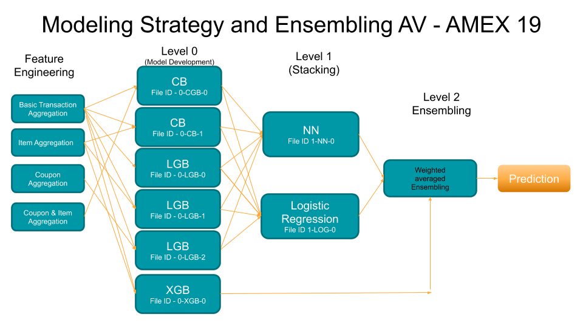

# AV-AMEX19
Analytics Vidhya's ML competittion ~~ AMEX - 19 

AMEX - 19 Solution Approach 

Public LB ~ 94.48

Public Rank - 4

Private LB ~ 93.17

Private Rank - 5

Mudit Tiwari

mudittiwari255@gmail.com

SECTION 0 - Briefing of the Solution

My major focus in this competition was on feature engineering. Since there were 5-6 tables to join on, I decided to take juices from all the tables to make feature rich datasets. I made 4 kinds of datasets upon aggregation of transaction data, which captured, customer, item as well as coupon behaviour. I tested and finalized my validation strategy. I tried with GKF and normal K Fold. Got better results with K Fold. Upon development of datasets I finalized 6 models, These 6 models were than used for stacking and ensembling giving approximately 96.2   CV and ~94.46 in public LB.

SECTION 1 -  Feature Engineering and Main Observations 

- Upon looking at all the provided tables the most interesting one was Customer Transaction Table. Aggregation of Customer Transaction table indeed helped in model performance. 
- Proper usage of transaction data was required to leave behind the possibilities of any leakage. (Used the transaction data for aggregation only till start date of every campaign ID.)
- I made many new logical features in transaction data like, total discount, discount percentage etc.
Various aggregations were performed corresponding to different numerical (Mean, min, max, std etc) as well as Categorical Features (modes*, nunique,  etc).
- Every coupon contained few item ids. So I decided to look at the number number of items purchased by every customer corresponding to every campaign. Eventually this feature came out to be the most important one. 
- Using the idea from the last point I made two different set of variables:
  1. For every Campaign & coupon ID go to respective transaction table and look for trends in item. (Called as item level aggregation.)
  2. For every Campaign & coupon ID look at the Coupon’s past trends, like the number of unique customers under this coupon from transaction table, or their similar trends.
(Called as coupon level aggregation.) 
- After an initial round of model development I came to know that  Coupon level aggregations were not coming off as good importance as item level aggregation. 
- This diverse variety of variables and trends captured from transaction data along with other tables, upon merging I was able to create 4 different & diverse datasets.

SECTION 2 : FINAL MODELING

4 Different datasets along with a bunch of different varieties of models gave me enough idea about the modeling process. I used plane K Fold, also I tried with Group K Fold, but OOT results with K Fold were better . Boosting was working fine, while bagging (RF) was not giving as par results. I decided to go with 3 different boosting techniques. CatBoost, LightGBM and XGBoost. I performed repeated experiments on these three models and available 4 datasets, and chose 6  models after manual parameter tuning and feature selection. The overall schematic flow diagram is given in the figure below. Among the final 6 models, all but one XGBoost model was used for 2 types of stacking one with simple Logistic Regression and one with ANN** (Manually Tuned).

Then a simple weighted average of two stacked prediction and one XGB prediction on the basis of CV and LB score was done to get a LB score of ~94.48.

